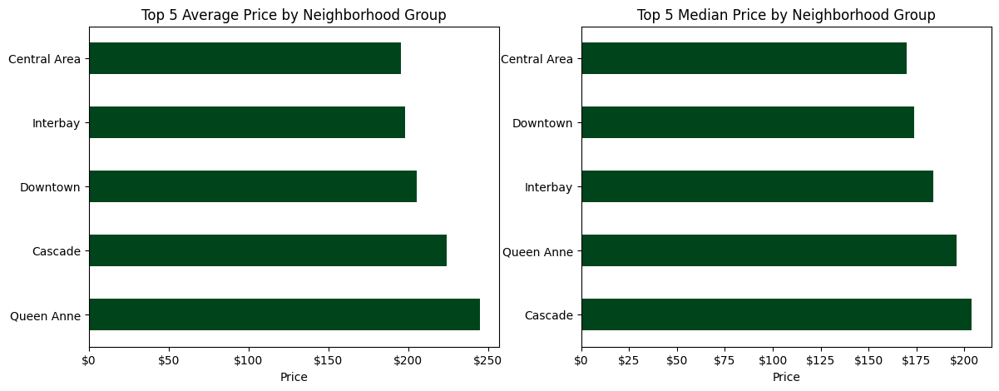
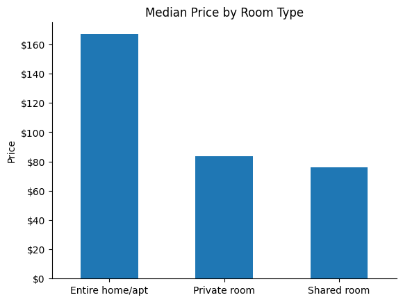

# Airbnb Seattle Pricing Analysis

## Overview
This project analyzes Airbnb listing prices in Seattle using public data from Inside Airbnb. The goal is to understand how prices vary across neighborhoods and what listing characteristics help explain those differences.

This repository contains my individual contribution to a larger group project. I was responsible for data cleaning and the analysis of neighborhood-level pricing patterns.

---

## Research Question
How do Airbnb prices vary across Seattle neighborhoods, and what listing characteristics help explain those differences?

---

## Example Results

### Neighborhood Price Differences

### Price by Room Type

---

## My Contribution
- Cleaned and prepared the dataset for analysis  
- Handled missing price data by backfilling from prior quarter data where available  
- Trimmed extreme outliers to reduce skew  
- Filtered to comparable short-term listings  
- Conducted analysis of price variation across neighborhood groups  
- Interpreted spatial pricing patterns and their relationship to listing characteristics  

---

## Data
This project uses data from Inside Airbnb, a publicly available dataset of Airbnb listings.

Seattle listings can be downloaded here:  
https://insideairbnb.com/get-the-data/

The raw data is not included in this repository due to file size constraints. To reproduce the analysis, download the Seattle listings datasets for 2Q25 and 3Q25 (`listings.csv.gz`) and place them in the `data/` folder.

---

## Methods
The analysis includes:
- converting price data to numeric format  
- backfilling missing prices using prior quarter data  
- trimming extreme outliers (top 1 percent)  
- filtering to comparable short-term listings  
- aggregating prices at the neighborhood group level  
- analyzing relationships between price, listing size, and room type  

---

## Key Findings
- Prices vary substantially across Seattle neighborhood groups  
- The highest priced areas are concentrated in central Seattle, near downtown and major commercial hubs  
- Larger listings and room type composition help explain part of the price differences  
- Median price provides a more stable measure than average price due to skew  

---

## How to Run

1. Download the required data and place it in the `data/` folder  
2. Run `01_data_cleaning.ipynb` to generate the cleaned dataset  
3. Run `02_EDA.ipynb` to reproduce the analysis  

---

## Tools
- Python  
- pandas  
- matplotlib  
- Jupyter Notebook  

---

## Limitations
This is a descriptive analysis and does not establish causal relationships. The results highlight pricing patterns but do not isolate the underlying drivers of those differences.

---

## Author
Vlad Lee
